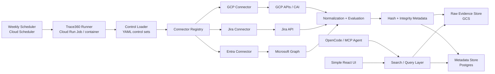

## Recommended target

Build **Trace360** as a scheduled evidence-collection platform with four parts:

1. **Collector runner** that executes controls on a schedule
2. **Raw evidence storage** for full payloads
3. **Searchable metadata store** for agent/UI queries
4. **Access layer** for agent search first, UI second

The reason this fits your outcome is:

* Cloud Scheduler is designed for cron-like scheduled work. ([Google Cloud Documentation][1])
* Cloud Run Jobs can execute batch workloads on a schedule. ([Google Cloud Documentation][2])
* Cloud Asset Inventory is a strong long-term source for broad GCP metadata collection and keeps a five-week metadata history. ([Google Cloud Documentation][3])
* Cloud Storage is the obvious raw evidence store, and Google provides lifecycle and retention features for stored objects. ([Google Cloud Documentation][4])
* Cloud SQL for PostgreSQL is a managed PostgreSQL option if you want a durable metadata/search layer without self-managing a DB. ([Google Cloud Documentation][5])

---

# 1. Architecture to build



## One-line explanation

* **Scheduler** runs jobs weekly
* **Runner** loads controls and executes connectors
* **Connectors** fetch evidence
* **Normalization/evaluation** turns raw data into control results
* **Hash/store** persists evidence
* **Agent/UI** search existing evidence instead of hitting live APIs every time

---

# 2. Build principles

These should be your design guardrails:

### A. Scheduled collection first

Do not make live connector calls the default user experience.
Use:

* scheduled evidence collection
* stored evidence
* fast search

This avoids the MCP timeout/runtime/auth pain you hit in the demo.

### B. Raw + normalized storage

Store both:

* **raw payloads** for audit defensibility
* **normalized metadata** for search and UI

### C. Connectors stay simple

Connector job:

* authenticate
* fetch raw data
* return dict

Not:

* hash
* store
* render UI
* interpret framework semantics

### D. Engine owns evidence lifecycle

The engine should own:

* control loading
* connector dispatch
* normalization
* evaluation
* hashing
* storage
* run history

### E. Agent searches evidence, not cloud first

For user experience:

* agent should search stored evidence
* live connector calls should be fallback / refresh actions

---

# 3. Suggested repo structure for Codex

Use this target structure:

```text
trace360/
├── README.md
├── pyproject.toml
├── .env.example
├── Dockerfile
├── opencode.json
│
├── controls/
│   ├── control_sets/
│   │   └── weekly_gcp_baseline.yaml
│   ├── gcp/
│   │   └── bucket_encryption.yaml
│   ├── jira/
│   │   └── offboarding_tickets.yaml
│   └── entra/
│       └── privileged_users.yaml
│
├── trace360/
│   ├── __init__.py
│   │
│   ├── core/
│   │   ├── models.py
│   │   ├── control_loader.py
│   │   ├── registry.py
│   │   ├── runner.py
│   │   ├── evaluator.py
│   │   ├── hashing.py
│   │   └── config.py
│   │
│   ├── connectors/
│   │   ├── gcp/
│   │   │   ├── collector.py
│   │   │   └── normalize.py
│   │   ├── jira/
│   │   │   ├── collector.py
│   │   │   └── normalize.py
│   │   └── entra/
│   │       ├── collector.py
│   │       └── normalize.py
│   │
│   ├── storage/
│   │   ├── gcs_store.py
│   │   ├── postgres_store.py
│   │   └── search.py
│   │
│   ├── interfaces/
│   │   ├── cli.py
│   │   ├── mcp_server.py
│   │   └── api.py   # later
│   │
│   └── schemas/
│       ├── evidence.py
│       └── control.py
│
└── ui/   # later React app
```

---

# 4. Data model to implement first

## A. Control definition

Start with a control YAML schema like this:

```yaml
id: GCP_BUCKET_ENCRYPTION
name: GCP bucket encryption review
connector: gcp
operation: get_bucket_encryption

scope:
  project_id: sai360-infosec-prj-d4fz
  bucket_name: sai360-infosec-extensions

expected:
  public_access_prevention: enforced
  uniform_bucket_level_access: true

evidence:
  requires_screenshot: false
  severity: medium
  framework:
    - CIS
    - SOC2
```

## B. Control set

For scheduled runs:

```yaml
id: WEEKLY_GCP_BASELINE
name: Weekly GCP baseline evidence run

controls:
  - controls/gcp/bucket_encryption.yaml
  - controls/gcp/firewall_logging.yaml
  - controls/gcp/sql_backup.yaml

schedule:
  frequency: weekly
```

## C. Evidence record

This should be your core schema.

```json
{
  "run_id": "uuid",
  "collected_at": "2026-04-21T12:00:00Z",
  "control_id": "GCP_BUCKET_ENCRYPTION",
  "connector": "gcp",
  "operation": "get_bucket_encryption",
  "resource_id": "gs://sai360-infosec-extensions",
  "status": "PASS",
  "severity": "medium",
  "framework": ["CIS", "SOC2"],
  "raw_evidence_uri": "gs://trace360-evidence/2026/04/21/...",
  "normalized_result": {
    "public_access_prevention": "enforced",
    "uniform_bucket_level_access": true,
    "cmek_enabled": false,
    "encryption_mode": "google-managed"
  },
  "evidence_hash": "sha256..."
}
```

---

# 5. Execution flow

Codex should build this exact flow.

## Step 1

Scheduler triggers weekly run.

## Step 2

Runner loads a control set YAML.

## Step 3

For each control:

* load YAML
* resolve connector + operation from registry
* call connector
* normalize result
* evaluate expected vs actual
* write raw evidence to GCS
* write metadata row to Postgres
* compute and store hash

## Step 4

Agent or UI queries Postgres for summaries and GCS for full detail.

---

# 6. Recommended cloud deployment model

## v1 production-ish

Use:

* **Cloud Scheduler** for weekly trigger
* **Cloud Run Job** to execute the collector batch
* **GCS** for raw evidence files
* **Cloud SQL for PostgreSQL** for searchable metadata

This is a strong GCP-native setup because Cloud Scheduler supports cron-like scheduled execution, and Cloud Run Jobs are explicitly designed for jobs and scheduled execution. ([Google Cloud Documentation][1])

Cloud SQL gives you a managed PostgreSQL store without managing infra yourself. ([Google Cloud Documentation][5])

GCS is a natural raw evidence store, and lifecycle/retention features can help control retention and storage costs. ([Google Cloud Documentation][4])

---

# 7. GCP source strategy

## What to implement now

* direct API for the connector you already have
* possibly one or two more direct connectors

## What to move toward

Use **Cloud Asset Inventory** as the primary source for broad GCP coverage. Google describes CAI as a global metadata inventory service for viewing, searching, exporting, monitoring, and analyzing asset metadata, and documents that it maintains a five-week history of asset metadata. ([Google Cloud Documentation][3])

### Recommendation

* **CAI first** for broad inventory-style controls
* **direct APIs** for controls CAI does not expose well
* keep the evidence model unchanged regardless of source

That gives you long-term maintainability.

---

# 8. Search and agent model

This is how to make it genuinely useful.

## Agent should support questions like:

* “Show failed controls from last week”
* “List evidence for GCP bucket encryption”
* “What changed since the previous run?”
* “Show offboarding evidence for user X”
* “Summarize high-severity findings in audit language”

## Search model

Postgres stores:

* control_id
* connector
* resource_id
* collected_at
* status
* severity
* framework
* raw_evidence_uri
* hash

Then the agent:

1. queries Postgres
2. fetches detailed raw evidence only if needed
3. interprets result

This is much better than live connector execution for every user question.

---

# 9. UI scope

Do not build a full platform UI first.

## v1 React UI should only have:

* Runs page
* Controls page
* Findings page
* Evidence detail page

### Runs page

* run ID
* timestamp
* total controls
* failed / passed counts

### Findings page

* control name
* resource
* severity
* status
* collected time

### Evidence detail

* normalized result
* raw evidence link
* hash
* framework tags

That’s enough.

---

# 10. MVP phases for Codex

## Phase 1 — scheduled collection backbone

Build:

* YAML control loader
* connector registry
* runner
* GCS raw evidence writer
* Postgres metadata writer
* one working scheduled job

### Deliverable

Weekly GCP bucket evidence gets collected and stored automatically.

---

## Phase 2 — search layer

Build:

* search functions over Postgres
* CLI / MCP tools:

  * `search_evidence`
  * `get_evidence_detail`
  * `list_recent_runs`

### Deliverable

Agent can answer evidence questions from stored data.

---

## Phase 3 — add Jira and Entra

Build:

* Jira connector
* Entra connector
* same evidence model
* same storage path

### Deliverable

Cross-system evidence under one engine.

---

## Phase 4 — simple React UI

Build:

* runs list
* findings list
* detail view

### Deliverable

Human-friendly evidence browser.

---

# 11. Codex build prompt you can use

Use something like this:

```text
Build Trace360 as a Python evidence-collection platform with these requirements:

1. Use a control-driven architecture.
2. Controls are defined in YAML files.
3. A control set YAML should allow grouped scheduled runs.
4. Implement a runner that:
   - loads control set YAML
   - resolves connector + operation from a registry
   - executes the connector
   - normalizes and evaluates the result
   - writes raw evidence JSON to GCS
   - writes metadata rows to PostgreSQL
   - computes a SHA-256 hash for the normalized evidence

5. Implement the following package structure:
   - trace360/core
   - trace360/connectors/gcp
   - trace360/connectors/jira
   - trace360/connectors/entra
   - trace360/storage
   - trace360/interfaces
   - trace360/schemas

6. Implement one working connector first:
   - GCP bucket encryption review
   - current direct API approach is acceptable initially

7. Implement evidence metadata fields:
   - run_id
   - collected_at
   - control_id
   - connector
   - operation
   - resource_id
   - status
   - severity
   - framework
   - raw_evidence_uri
   - normalized_result
   - evidence_hash

8. Implement a CLI with commands:
   - run-control
   - run-control-set
   - search-evidence
   - list-runs

9. Keep the code simple, readable, and maintainable.
10. Do not introduce FastAPI yet unless needed for search endpoints later.
11. Assume deployment target is:
   - Cloud Scheduler
   - Cloud Run Job
   - GCS
   - PostgreSQL
```

---

# 12. Final recommendation

Your best next-step approach is:

**weekly scheduled runner + GCS raw evidence + Postgres metadata + agent search over stored evidence**

That gives you:

* automation
* history
* speed
* auditability
* a clean path to UI and GRC integration

If you want, I can next turn this into a **technical design document with sections like Goals, Non-Goals, Components, Data Model, Run Flow, and MVP Roadmap** so you can paste it directly into Codex or a repo doc.

[1]: https://docs.cloud.google.com/scheduler/docs/overview?utm_source=chatgpt.com "About Cloud Scheduler"
[2]: https://docs.cloud.google.com/run/docs/execute/jobs-on-schedule?utm_source=chatgpt.com "Execute jobs on a schedule | Cloud Run"
[3]: https://docs.cloud.google.com/asset-inventory/docs/asset-inventory-overview?utm_source=chatgpt.com "Cloud Asset Inventory overview"
[4]: https://docs.cloud.google.com/storage/docs/lifecycle?utm_source=chatgpt.com "Object Lifecycle Management | Cloud Storage"
[5]: https://docs.cloud.google.com/sql/docs/postgres?utm_source=chatgpt.com "Cloud SQL for PostgreSQL documentation"
